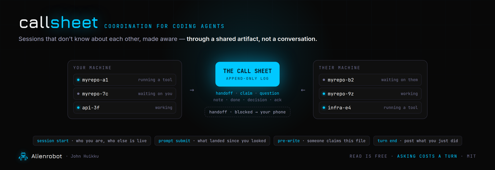

# callsheet

**A coordination method for people running several coding-agent sessions at once.**
Sessions learn who they are, see what the others are doing, and hand work between
each other — through a shared artifact instead of a conversation.

No code, by design. This is a method and a set of build instructions you hand to your
own agent, because the specifics of any one implementation go stale far faster than
the reasoning does.

---

## The problem

Coding agents are good at working. They are terrible at working *near each other*.

Open six sessions across two repos — which is now an ordinary Tuesday — and you get a
room full of capable specialists who have never been introduced:

- **Two of them edit the same file** and the second silently overwrites the first. Nothing
  warns either one.
- **You can't tell which one is waiting on you** without clicking through every tab and
  reading.
- **Asking one what it's doing is expensive.** A message costs that session a full model
  turn to answer, and if it's parked, it won't see the question until you touch it anyway.
- **Handing work from one to another means you copy-paste.** You are the message bus.
- **A second developer changes nothing**, because none of it crosses the machine boundary.
  Their agents and yours have no idea the other exists.

The tempting fix is to let the agents talk to each other. That's the wrong fix, and it
scales the way a room where everyone talks at once scales.

## The solution

A film set solves this problem every day, with a hundred people, and almost none of the
solution is conversation.

**The call sheet** goes out the night before: where, when, who's needed, what gear. Everyone
reads it. Nobody asks — if people are asking, the call sheet has failed. **Departments own
their kit**, and nobody negotiates that. **The walkie is for when you need someone to *act***,
not to find out how it's going. **Video village** lets you watch what the camera is doing
without interrupting the operator.

Every one of those is coordination through a shared artifact. `callsheet` is that, for agent
sessions:

| On set | Here |
|---|---|
| You're told your name and department when you arrive | Each session is told its own identity at startup, before its first prompt |
| Video village — watch without interrupting | Status **read** from what sessions have already written, never by asking them |
| The call sheet — everyone reads it, nobody asks | An append-only board of notes, handoffs, blockers and claims |
| The production office writes the sheet | A turn-end hook posts each session's work automatically — nobody has to remember |
| You don't move another department's stands | A claim on a file warns the next session that tries to write it |
| The walkie, for when you need action | Direct messaging — the last resort, not the first |
| The production office, when it's a two-unit shoot | An optional hosted board so two developers' agents share one call sheet |

## What it gets you

- **A coordinator tab.** One session whose only job is answering *"what's going on?"* — what every
  session is doing, what's stuck, what the other person sent, where two sessions collide. It
  answers about ten sessions as cheaply as one, because it reads rather than asks. This needs
  **no server**, and it's the first thing most people find they can't work without.
- **Every session knows its own name**, and yours — so it can be addressed and can address others.
- **"What is my other session doing?"** answered in a fraction of a second, costing that
  session nothing.
- **"Who's waiting on me?"** across every tab, in one line.
- **A warning before you clobber** a file another session is working in.
- **Handoffs that arrive on their own** — the receiving session sees them at the top of its
  next prompt, with an acknowledgement so nothing is silently dropped.
- **Answers that come back**, surfaced ahead of everything else — "they replied to the thing you
  sent" is the one board event that usually needs doing something about.
- **Questions answered by machine.** A factual question about a repo — *what sets X, where is Y
  handled* — can be answered by the other side's machine reading its own working tree, with
  file:line citations, in under a minute, with no person involved.
- **Real conversations** between two of your own sessions when an exchange needs the other one's
  context, with a check first on whether it's safe to interrupt.
- **Across two developers**, optionally: one shared board, handoffs addressed to a *person*,
  attachments and screenshots that travel with them, and a phone notification when something
  genuinely needs one — the backend posts to whatever chat service you already use (Slack,
  Telegram, Signal, Discord, or a plain push service), and runs wherever you already host things,
  including your own machine over a private network.

## The five ideas worth stealing

Even if you never build this, these are the parts that carry:

1. **Reading is free; asking is expensive.** Status should never cost a model turn. Build
   the read path before you build any messaging.
2. **Coordinate through traces, not conversation.** A note left in a shared place needs
   neither the reader's attention nor the reader's existence.
3. **Automate the posting.** Any board that depends on an agent *remembering* to update it
   is empty by Thursday. Post at turn end, from a hook.
4. **Deliver it to the agent, not to a dashboard.** A human status panel doesn't help the
   session that's about to overwrite your file.
5. **Fail open.** The coordination layer must never block, slow, or break the actual work.
   Short timeouts, local fallback, advisory warnings.
6. **Let the asker say what a machine may take.** A question marked answerable can be answered by
   a machine reading the repo; a handoff always needs a person. Putting that call in the asker's
   hands, rather than in a classifier, is the whole safety model.
7. **Know when you've broken.** Everything here reads undocumented internals that change without
   notice. Build a self-check, and make it measure something that can actually fail.

## What you need

**There is no service to sign up for.** Nobody operates this for you — there's no hosted
instance, no account, no API to call. It's a method you and your agent implement, and you own
whatever it runs on.

The good news is that it splits into two halves with very different costs, and **most of the
value is in the free one**:

### On one machine — nothing at all

Identity, seeing what your other sessions are doing, the board, file claims, handoffs between
your own tabs: **no server, no database, no network, no accounts.** It's a script, four hooks,
and an append-only file in your config directory. If you only ever build this half, it still
solves the "two tabs just edited the same file" and "which one is waiting on me" problems.

Requirements: an agent CLI that (a) records its live sessions somewhere on disk, (b) writes
transcripts you can read, and (c) has hooks for session start, prompt submit, pre-write and turn
end. Part 0 of [BUILD.md](BUILD.md) tells your agent how to find those for your tool and version.

### Across two developers — you run the infrastructure

The shared board, cross-machine handoffs, machine-answered questions and phone notifications need
things you host:

| you need | what it actually is |
|---|---|
| **A small server** | one table, seven endpoints, no queue, no workers. Any app platform, an edge runtime, or your own machine on a mesh VPN — see [ARCHITECTURE §8](ARCHITECTURE.md) |
| **A database** | anything you already run. The table is tiny |
| **A chat bot**, if you want phone notifications | you register it yourself with whichever service you use — a bot token or webhook is minutes' work; a self-hosted bridge is an afternoon. Both people join one group |
| **A token per person** | you mint them; the server maps token → person. This is the whole authorization model |
| **An agent CLI that can run headless**, only if you want machine-answered questions | the responder shells out to it with a cheap model and read-only tools |

None of it is large — the point is that it's *yours*, so no third party sits between two
developers' agents, and revoking someone is deleting one row.

## Who this is for

People comfortable wiring hooks into their agent CLI and, for the shared half, running a small
service of their own. You'll be handing the build instructions to your own agent and reviewing
what it writes — this assumes you're happy doing that, and happy operating the result.

If you don't want to host anything, build the one-machine half. It needs nothing and it's where
most of the value is.

**What this is not:** not a package to install; not a supervisor that decides when your sessions
work; and **not an orchestrator or spawner**. That distinction matters, because the orchestrators
are the bigger and better-known category — tools that plan work, launch a fleet of agents, and
give each its own worktree, with a board for you to supervise from. Those are excellent, and
they're solving a different problem: agents you **delegate to**. This is for the sessions you're
**driving yourself**, which already exist and were never isolated from each other.

## Where to start

- **[ARCHITECTURE.md](ARCHITECTURE.md)** — how it's designed and why: the cost model, identity,
  the board, the hook lifecycle, the claim protocol, the trust model, and what breaks.
- **[BUILD.md](BUILD.md)** — the build instructions, written to be handed to a coding agent.
  Seven parts, each with a test that tries to break it before you move on.
- **[CREDITS.md](CREDITS.md)** — where every part of this came from. Worth reading before you
  build: several projects got here first, and at least one of them may suit you better.

Start with ARCHITECTURE if you want the reasoning, BUILD if you want the thing.

## This is not new

A shared space that independent workers post to and read from, instead of addressing each other,
is the **blackboard architecture** — named in 1962, built as Hearsay-II in 1980. The property
it leans on, that a posted entry needs neither the reader's identity nor the reader's existence,
is **generative communication** (Linda, 1985). Coordinating through traces left in a shared
environment is **stigmergy** (1959). And several people have already built versions of this for
coding agents specifically.

[CREDITS.md](CREDITS.md) names all of them, and what each one taught us. If you only read one
other file, read that one — it may save you building this at all.

## Why "callsheet"

I worked in film production before I wrote software for it. A set is the most refined machine
people have built for coordinating specialists who must not interrupt each other — and it
runs on artifacts, not chatter.

Running a dozen coding agents turns out to be the same problem with the same answer. The
academic name for it is the *blackboard architecture* (Hearsay-II, 1980); the biological one
is *stigmergy* (Grassé, 1959). The film one is a call sheet, and it's the one I already knew.

## License

MIT — see [LICENSE](LICENSE). By [John Huikku](https://alienrobot.com) / Alienrobot LLC.
